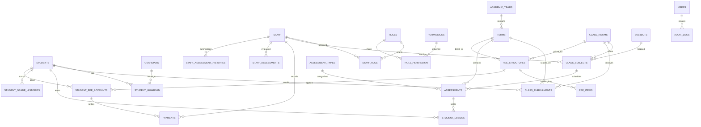

# High School MIS ER Diagram

## Notes

- `users` can represent either a staff member or a guardian.
- `class_subjects` resolves the many-to-many relationship between classes and subjects and stores the assigned teacher.
- `student_grade_histories` stores final promotion and annual performance snapshots.
- `audit_logs` captures security-sensitive actions such as login, grade edits, and finance changes.
